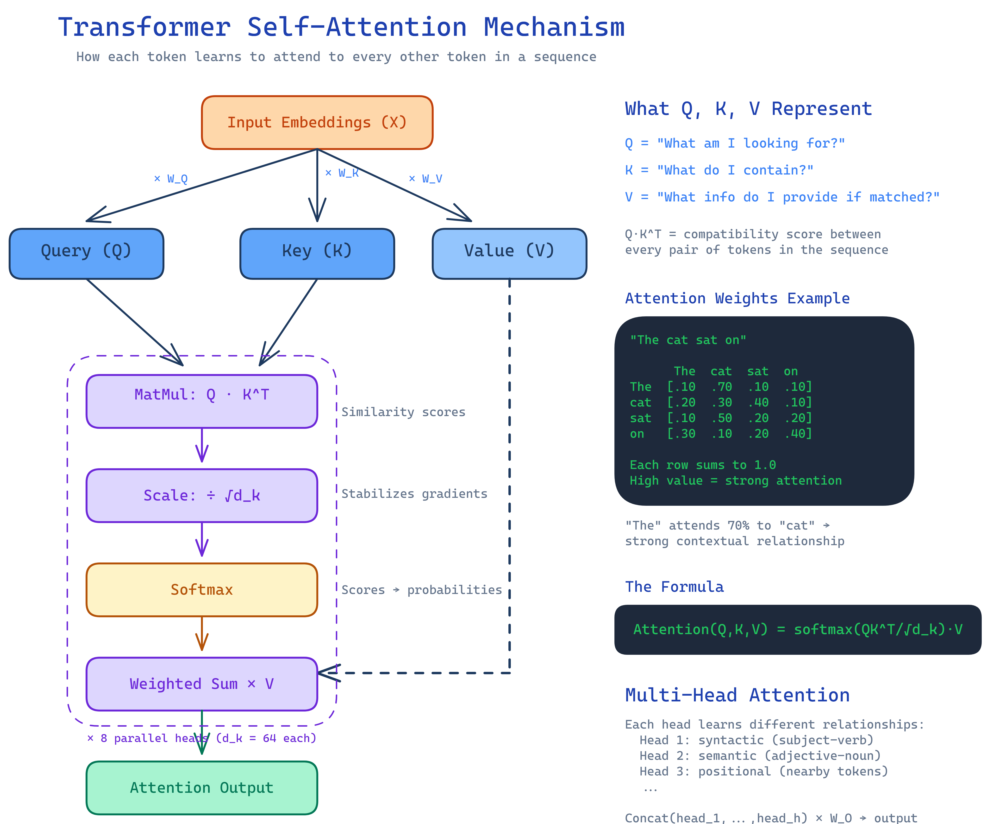
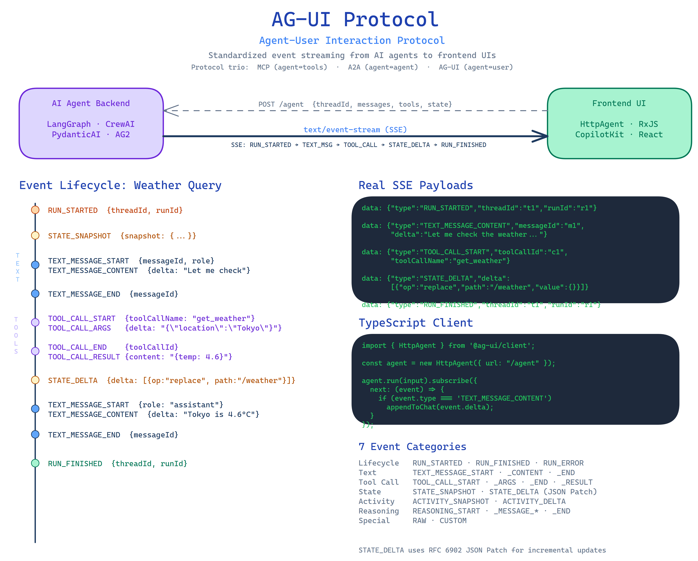

# Excalidraw Skill Demo

Demonstration of AI-generated Excalidraw diagrams using the [excalidraw-diagram-skill](https://github.com/coleam00/excalidraw-diagram-skill) for Claude Code.

## Diagrams

### Transformer Self-Attention Mechanism

**Prompt:** `use excalidraw skill to explain the transformer attention mechanism`

- Fan-out pattern showing Input → Q, K, V projections through learned weight matrices
- Assembly-line pipeline: Q·K^T → Scale → Softmax → Weighted sum with V
- Concrete 4×4 attention weight matrix for "The cat sat on"
- Multi-head attention explanation (8 parallel heads learning syntactic, semantic, and positional relationships)

### AG-UI Protocol Event Streaming

**Prompt:** `Create an Excalidraw diagram showing how the AG-UI protocol streams events from an AI agent to a frontend UI`

- Hero flow: AI Agent Backend → SSE Stream → Frontend UI
- Full event lifecycle for a weather query (RUN_STARTED → STATE_SNAPSHOT → TEXT_MESSAGE_* → TOOL_CALL_* → STATE_DELTA → RUN_FINISHED)
- Real SSE wire-format payloads and TypeScript client code
- All 28+ event types organized into 7 categories (Lifecycle, Text, Tool Call, State, Activity, Reasoning, Special)

## Usage

1. Install the [excalidraw-diagram-skill](https://github.com/coleam00/excalidraw-diagram-skill) in Claude Code
2. Ask Claude to create a diagram on any topic
3. Open the generated `.excalidraw` files at [excalidraw.com](https://excalidraw.com) to view or edit
